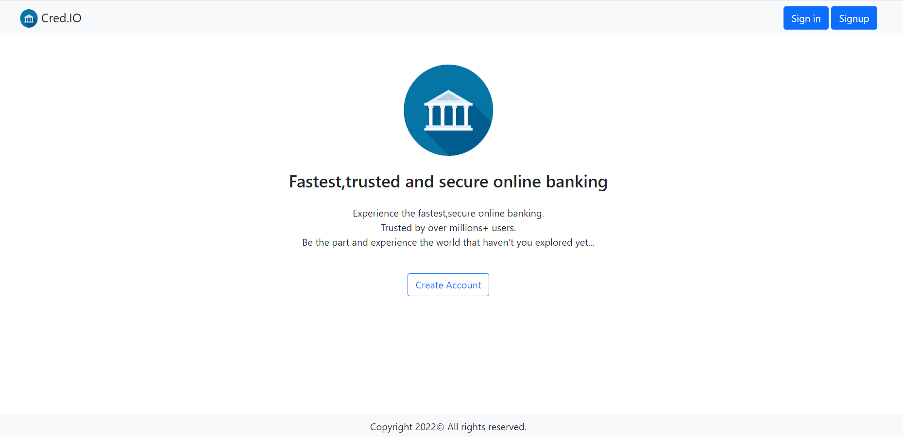

# Credit-Debit-System

It is a credit-debit system in java,jsp,servlet,mysql,etc

To run this project on your machine follow below instructions:
👉👉 Change database variables in src/mainController/connection.java file...
👉👉 SQL file of database is provided in web/ folder...📑
👉👉 To get started with application create account and then login with that email and password...

Functionalities: 💡💡
1. Signup and Sign in
2. Dashboard user specific, user who get logged in can credit/debit, watch history on self account...
3. After logout user will have no more access to dashboard and history pages...
